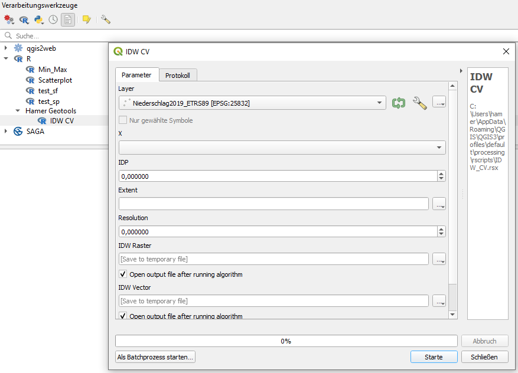

# Preparation
Before you can use the tools you need to:

## 1. [Install R](https://www.r-project.org/)

## 2. [Implement](https://docs.qgis.org/3.10/en/docs/user_manual/plugins/plugins.html) the QGIS Plugin [Processing R Provider](https://plugins.qgis.org/plugins/processing_r/)

## 3. Implement Tool
Either clone this repository and link the tools folder to QGIS

or create a new R-Tool 

and copy the content of the tool or copy the .rsx-file to the correct folder.

## 4. Install libraries

Install the R libraries used in the tool

in the R environment. To do so open R

and then install the packages

## 5. Use the tool in QGIS

